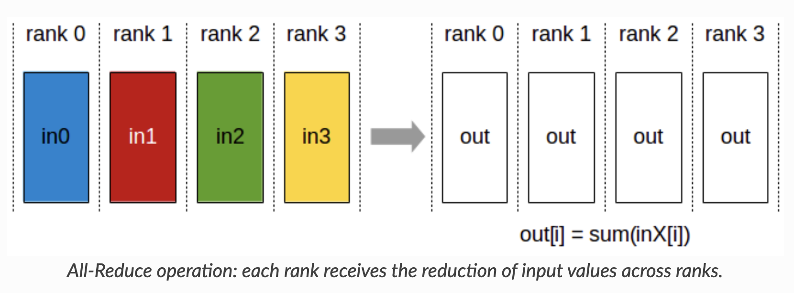
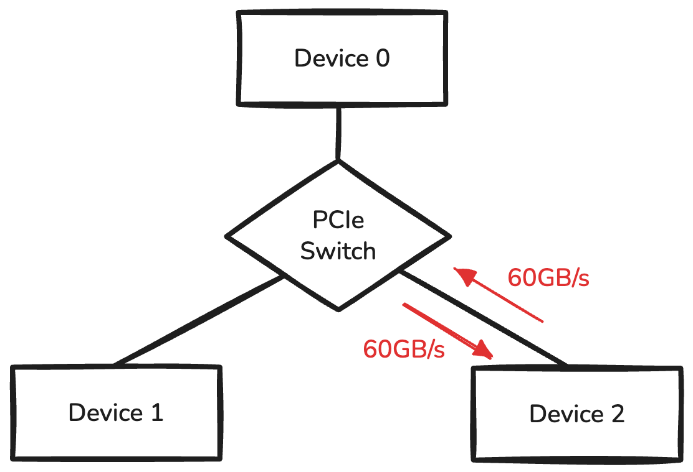
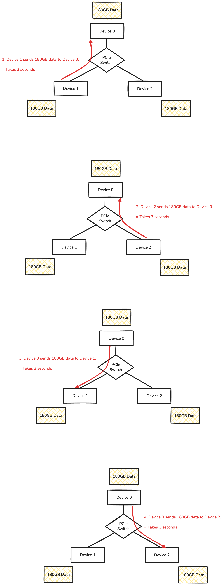
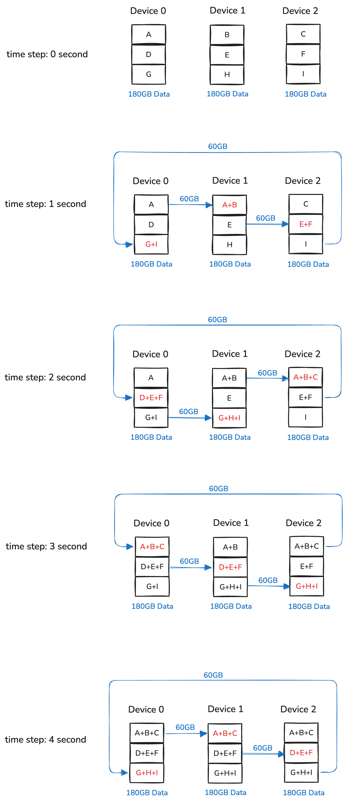

## Summary

AllReduce is a collective communication operation that performs the reduce function for all the data.

Let's talk about the most efficient algorithm for allReduce. How should the data move?

## Assumptions

Assume we have 3 devices, and we want to perform allReduce operation. Each device is connected to PCIe switch, and the link is full-duplex with 60GB/s bandwidth.

We assume each device has 180GB of data.

## Naive Approach

The naive approach is to collect all the data to single device, and then perform the reduce operation. After that, we send the result to all the other devices.

Naive approach takes 12 seconds to complete the allReduce operation.

Big problem with naive approach is that it doesn't utilize the full bandwidth of the links.

## Ring Algorithm

The ring approach is to let each device send its data to the next device in the ring.

Ring approach takes 4 seconds to complete the allReduce operation.

As you can see, ring approach utilizes the full bandwidth of the links.

> In general, for $N$ devices and $B$bytes/s bandwidth, ring approach takes $2 \cdot (N-1) / N$ time to complete the allReduce operation for $B$ bytes of data.