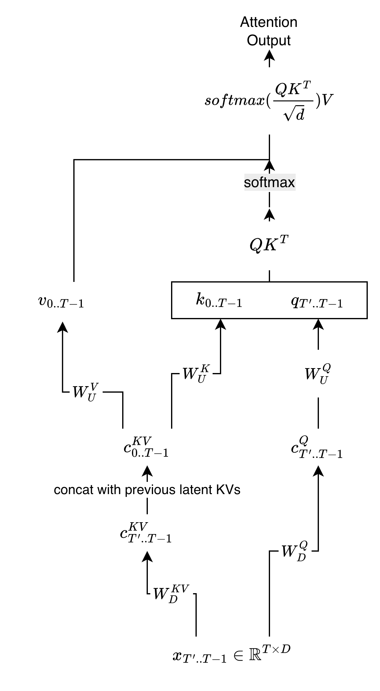
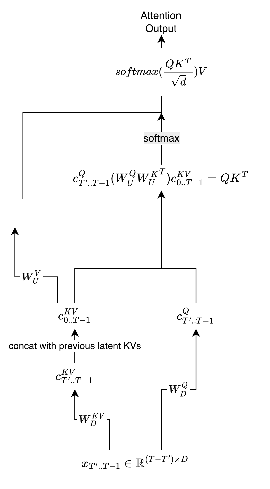

## Summary

After "Attention is All You Need" was published in 2017, attention mechanism has been widely used in various AI models. However, the original attention mechanism has some limitations, growing size of KV caches. To overcome this issue, Deepseek-v2 introduces Multihead Latent Attention (MLA) technique, which compresses the KV caches into a smaller latent space, and also allows more efficient attention computation.

## Terminology
$x_t \in \mathbb{R}^{D}$: hidden state for $t$ th token

$D$: Dimension of hidden state $x_t$

$K_t \in \mathbb{R}^{D}$: Key for $t$ th token

$V_t \in \mathbb{R}^{D}$: Value for $t$ th token

$Q_t \in \mathbb{R}^{D}$: Query for $t$ th token

$r_{kv}$: Dimension of latent representation for KV cache

$c_t^{KV} \in \mathbb{R}^{r_{kv}}$: Latent representation of KV cache for $t$ th token. In other words, this is compressed representation of $K_t$ and $V_t$. This can be decompressed into $K_t$ and $V_t$ through linear transformation.

$W_D^{KV}$: Down projection matrix for KV cache. This matrix transforms $x_t$ into $c_t^{KV}$

$W_U^K$: Up projection matrix for Key. This matrix transforms $c_t^{KV}$ into $K_t$.

$W_U^V$: Up projection matrix for Value. This matrix transforms $c_t^{KV}$ into $V_t$.

$r_q$: Dimension of latent representation for Query

$c_t^Q \in \mathbb{R}^{r_q}$: Latent representation of Query for $t$ th token. This is compressed representation of $Q_t$. This can be decompressed into $Q_t$ through linear transformation.

$W_D^Q$: Down projection matrix for Query. This matrix transforms $x_t$ into $c_t^Q$

$W_U^Q$: Up projection matrix for Query. This matrix transforms $c_t^Q$ into $Q_t$.

$D_{position}$: Dimension of position part for Query and Key.

$q_{t,position} \in \mathbb{R}^{D_{position}}$: Query for position part of $t$ th token

$k_{t,position} \in \mathbb{R}^{D_{position}}$: Key for position part of $t$ th token

$W_{UR}^Q$: Up projection matrix for Query for position part. This matrix transforms $c_t^Q$ into $q_{t,position}$

$W_{UR}^K$: Up projection matrix for Key for position part. This matrix transforms $c_t^{KV}$ into $k_{t,position}$

## Naive Implementation

The following figure illustrates the naive structure of MLA:

This implementation still benefits from the compression of KV cache. The memory pressure for decoding will be reduced. However, the computational cost is high because we have to up project all the latent vectors($c_t^{KV}$ and $c_t^Q$) into their respective high-dimensional representations.

## Optimized Implementation

Deepseek-v2 introduces an fused implementation of MLA that reduces the computational cost by fusing the up projection and attention computation. The following figure illustrates the fused structure of MLA:

In this implementation, we calculate and store $W_U^Q{W_U^{K}}^T$ in advance. 

In naive implementation, to calculate attention score($QK^T$), we had to do the following steps:
1. Up project $c_{T'..T-1}^Q$ into $Q_{T'..T-1}$ using $W_U^Q$
2. Up project $c_{0..T-1}^{KV}$ into $K_{0..T-1}$ using $W_U^K$
3. Calculate attention score using $Q_{T'..T-1}$ and $K_{0..T-1}$

However, in the optimized implementation, we fuse the up projection and attention computation. It can be done in following steps:
1. In static time, calculate and store $W_U^Q{W_U^{K}}^T$
2. Calculate attention score using $c_{T'..T-1}^Q$ and $c_{0..T-1}^{KV}$ and $W_U^Q{W_U^{K}}^T$:
$QK^T = c_{T'..T-1}^Q (W_U^Q {W_U^{K}}^T) c_{0..T-1}^{KV}$

## Positional Embedding for MLA
Rotary positional embedding is widely used in attention. MLA also uses rotary positional embedding, but it is used quite differently to the original RoPE. In MLA, if we try to apply RoPE to $Q$ and $K$ directly, we cannot utilize the fused implementation because RoPE matrix is dynamic(it changes with the position). To solve this issue, MLA separates the Query and Key into two parts: the content part and the position part.

$$QK^T = [q_{content}, q_{position}]  \begin{bmatrix} k_{content}^T \\ k_{position}^T \end{bmatrix} = q_{content}k_{content}^T + q_{position}k_{position}^T$$ 

The position part of the query and key is calculated using the rotary positional embedding:

$$q_{position} = RoPE(W_{UR}^Qc_{T'..T-1}^Q)$$

$$k_{position} = RoPE(W_{UR}^Kc_{0..T-1}^{KV})$$

Content part and position part are calculated in parallel, and then they are added together to get the final attention score. **To make the calculation time of position part same as the content part, we decrease the dimension of the position part.($D_{position}$)**

## Benefits of MLA
MLA has several benefits compared to the original attention mechanism:
1. **Reduced KV Cache size**: By compressing the KV cache into a smaller latent space, MLA significantly reduces the memory pressure during decoding. This allows for longer sequences to be processed without running out of memory.
2. **Efficient Attention Computation**: The fused implementation of MLA reduces the computational cost by fusing the up projection and attention computation. This allows for faster inference without sacrificing performance. Specifically, $W_U^Q{W_U^{K}}^T \in \mathbb{R}^{r_q \times r_{kv}}$ matrix is small. As a result, the required attention computation gets smaller.
3. **Orthogonal to GQA**: MLA can be combined with GQA to further reduce the computational cost. GQA reduces the number of attention heads, while MLA reduces the dimension of KV cache. These two techniques can be used together to achieve even more efficient attention computation.